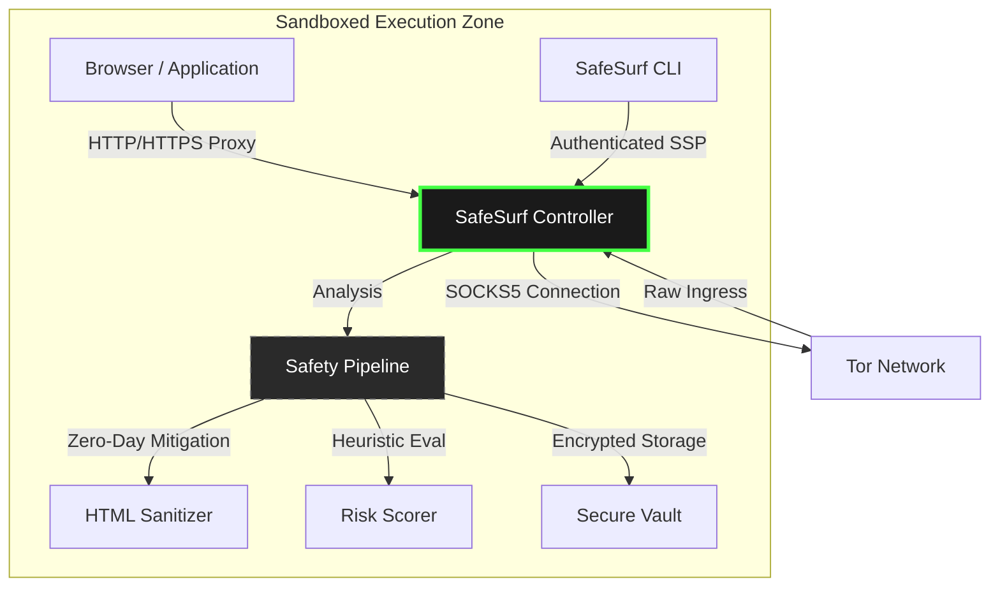
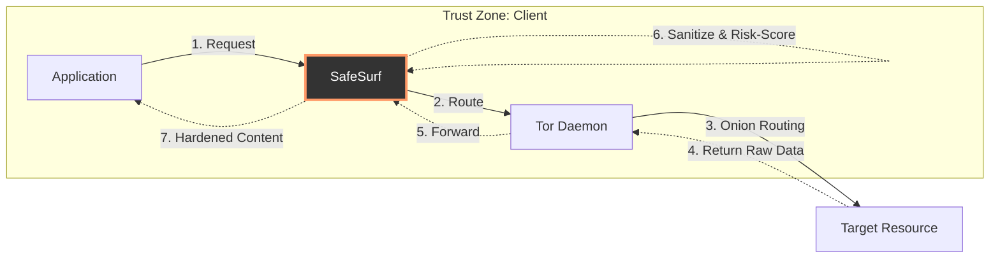
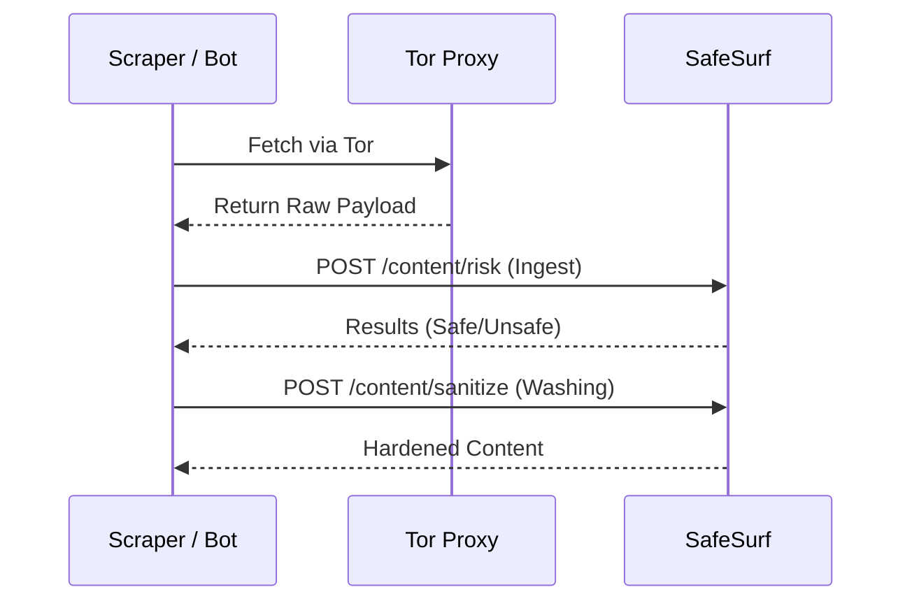

<div align="center">

# 🌊 SafeSurf Protocol
### *The Definitive Safety Layer for the Invisible Web*

[](https://github.com/the-shadow-0/SafeSurf-protocol)
[](https://github.com/the-shadow-0/SafeSurf-protocol/blob/main/LICENSE)
[](https://github.com/the-shadow-0/SafeSurf-protocol/blob/main/SECURITY.md)
[](https://www.linux.org/)

</div>

---

## 📖 Overview

**SafeSurf Protocol (SSP)** is a state-of-the-art, defensive networking implementation designed to provide a "clean-pipe" experience for users navigating anonymization networks (Tor, I2P). Unlike traditional proxies that focus solely on identity, SafeSurf prioritizes **Content Integrity** and **Metadata Hardening**.

By intercepting and "washing" traffic at the protocol level, SafeSurf neutralizes browser-based exploits, strips malicious telemetry, and provides a deterministic safety score for every node you visit.

---

## 🏛 Architecture & Architectural Flow

SafeSurf operates as a local security controller that "washes" untrusted network traffic before it reaches your applications. It follows a **Defense-in-Depth** model: **Browser -> SafeSurf -> Tor**.

### 🛡️ System Architecture


### 🛰️ Network Chaining Flow (The "Wash" Cycle)
SafeSurf implements a sophisticated proxy-chaining mechanism to ensure no data is processed without inspection.



---

## ✨ Premium Security Features

| Feature | Description | Primitive |
| :--- | :--- | :--- |
| **Neutralization Engine** | Aggressively strips scripts, tracking pixels, and malicious tags. | `ammonia-rs` |
| **Secure Handshake** | Ephemeral, authenticated local control plane. | `X25519` / `Handshake` |
| **Memory Isolation** | All sensitive data is zeroed immediately after use. | `zeroize` |
| **Hardened Vault** | High-entropy storage for deep-web credentials. | `Argon2id` / `XChaCha20-P1305` |
| **Global Jitter** | Defeats traffic analysis via timing obfuscation. | `safe_surf_core::privacy` |

---

## 🚀 Deployment & Operations

### 📦 Installation (Linux Ecosystem)
```bash
# 1. Clone & Secure
git clone https://github.com/the-shadow-0/SafeSurf-protocol.git
cd SafeSurf-protocol

# 2. Production Optimized Build
cargo build --release

# 3. Register System Service
sudo cp target/release/safe_surfd /usr/bin/
sudo cp safe-surfd.service /etc/systemd/system/
sudo systemctl daemon-reload
sudo systemctl enable --now safe_surfd
```

### 🎛️ System-Wide Integration
Route every application on your machine through the safety engine with a single command:
```bash
# Enable Global Transparency
./target/release/safe_surf_cli sys-setup --enable
```
*Note: This utilizes GNOME GSettings and environment injection for maximum coverage.*

---

## 🛠 Integration Patterns

### 1. Tor Browser (Defense-in-Depth)
Configure Tor Browser to use SafeSurf as its **Primary HTTP Proxy** (`127.0.0.1:8080`).
- **Result**: You gain protection against browser exploits even if Tor's builtin security fails.

### 2. Headless/SDK Pattern (Daemon-as-a-Service)
Use SafeSurf as a high-security microservice for automated tools.



---

## ⚖️ Ethical Foundation & Compliance

- **Defensive Design**: SafeSurf is explicitly built as a shield. It does NOT facilitate illegal access, proxy bypassing, or anonymity service creation.
- **Privacy First**: We do not log URLs, payloads, or user identifiers. All processing occurs locally on the host.

---

## 🛡️ Security Policy
Found a bug? Help us keep the web safe. Submit a report via [GitHub Issues](https://github.com/the-shadow-0/SafeSurf-protocol/issues) or consult [SECURITY.md](SECURITY.md).

**License**: Distributed under the **MIT License**. Created by the-shadow-0.
