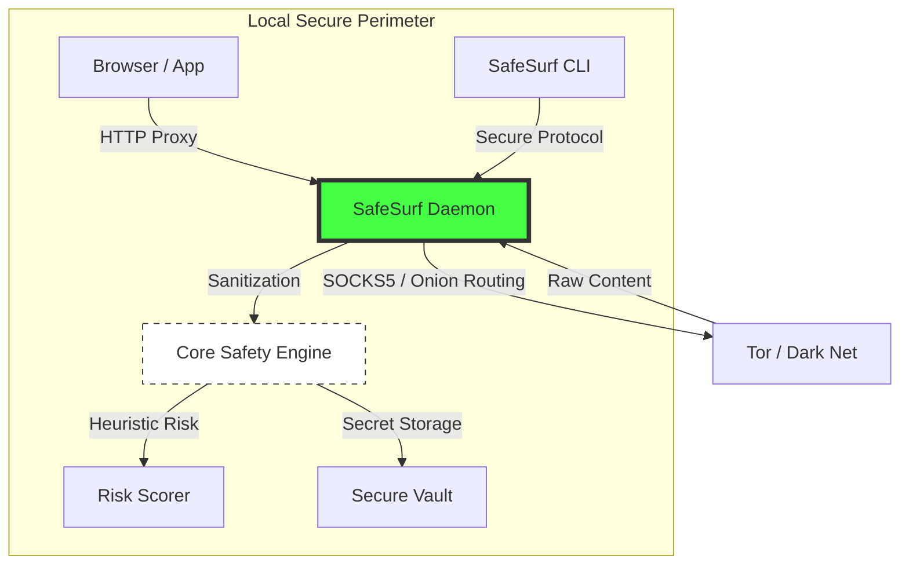
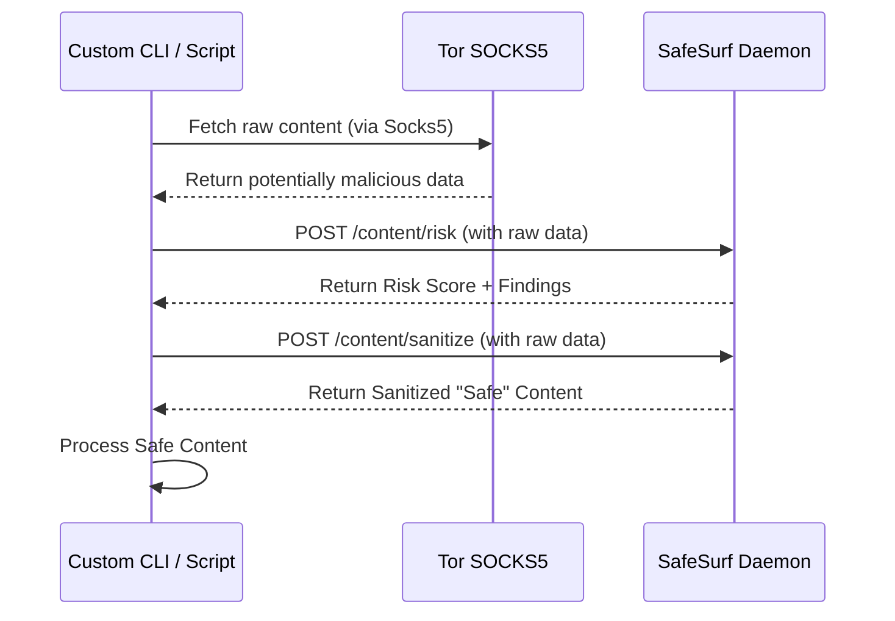

# SafeSurf Protocol (Official Reference Implementation)

[](https://github.com/the-shadow-0/SafeSurf-protocol)
[](https://github.com/the-shadow-0/SafeSurf-protocol/blob/main/LICENSE)
[](https://github.com/the-shadow-0/SafeSurf-protocol/blob/main/SECURITY.md)
[](https://www.linux.org/)

**SafeSurf Protocol** is a defensive, privacy-first safety layer designed to protect users navigating risky networks, including the deep web and dark net. It supplements traditional anonymity tools (like Tor) by neutralizing malicious content, preventing credential theft, and mitigating metadata leakage through content-level sanitization and heuristic risk scoring.

---

## 🏛 Architecture & Architectural Flow

SafeSurf acts as a local security controller that "washes" untrusted network traffic before it reaches your applications. It follows a **Defense-in-Depth** model: **Browser -> SafeSurf -> Tor**.

### System Architecture


### Network Chaining Flow
This diagram illustrates how SafeSurf intercepts and filters traffic between your application and the Tor network.

```mermaid
graph LR
    subgraph Client Device
        A[Browser / App] -->|1. Intercept HTTP Proxy| B[SafeSurf Controller]
        B -->|2. Route SOCKS5| C[Tor Daemon]
    end
    C -->|3. Onion Routing| D[Deep Web Resource]
    D -->>|4. Return Raw Data| C
    C -->>|5. Forward| B
    B -->>|6. Sanitize & Score| B
    B -->>|7. Delivery Safe Content| A
    
    style B fill:#f96,stroke:#333,stroke-width:4px
```

---

## 🛠 Integration Patterns

### 🧵 Pattern 1: Tor Browser Integration (GUI)
You can configure the Tor Browser to use `safe_surfd` as its HTTP/HTTPS proxy. 
- **Effect**: Every page you visit is automatically screened for risk and sanitized before the browser's rendering engine ever sees it.
- **Benefit**: Provides an additional layer of protection against 0-day browser exploits and identity-leaking scripts.

### 🤖 Pattern 2: Daemon-as-a-Service (Headless/CLI)
If you are building custom scraping tools or headless applications, you can use `safe_surfd` as a **Safety Microservice**.



---

## ✨ Key Features

- 🛡️ **Neutralization Engine**: Strips active scripts, tracking pixels, and harmful HTML attributes before rendering.
- 🔐 **Secure Handshake**: Noise-inspired ephemeral key exchange (X25519) for all local control traffic.
- 🗄️ **Argon2id Vault**: Local-first encrypted storage for identity-sensitive tokens and private keys.
- 📉 **Explainable Risk Scoring**: Heuristic data analysis providing a transparency-first "Safety Score" for deep-web nodes.
- 🚀 **Production Hardening**: Integrated `systemd` service with sandboxing (PrivateTmp, etc.) and global proxy injection tools.

---

## 🚀 Quickstart & Installation

### 1. Build from Source
```bash
git clone https://github.com/the-shadow-0/SafeSurf-protocol.git
cd SafeSurf-protocol
cargo build --release
```

### 2. Install as a System-Wide Daemon
Deploy SafeSurf as a hardened background service on any Linux system:
```bash
sudo cp target/release/safe_surfd /usr/bin/
sudo cp safe-surfd.service /etc/systemd/system/
sudo systemctl daemon-reload
sudo systemctl enable --now safe_surfd
```

### 3. Auto-Configure Global Proxy
Route all system traffic through the safety engine with a single command:
```bash
# Auto-configures GNOME/D-Bus settings
./target/release/safe_surf_cli sys-setup --enable
```

---

## ⚙️ Development & CI
The project includes primary automated quality gates:
- **`cargo test`**: Full suite of cryptographic and sanitization tests.
- **`cargo-audit`**: Automated vulnerability scanning for dependencies.
- **`cargo clippy`**: Strict linting for production-quality standards.

---

## ⚖️ Ethics & License

- **Ethical Foundation**: This protocol is strictly defensive. It aims to protect user privacy and safety, and must not be used to facilitate illegal activity or circumvent lawful transparency.
- **License**: This project is licensed under the **MIT License**. See [LICENSE](LICENSE) for the full legal text.

---

## 🛡️ Security
Security is our priority. If you discover a vulnerability, please report it via [GitHub Issues](https://github.com/the-shadow-0/SafeSurf-protocol/issues). Detailed disclosure policy in [SECURITY.md](SECURITY.md).
